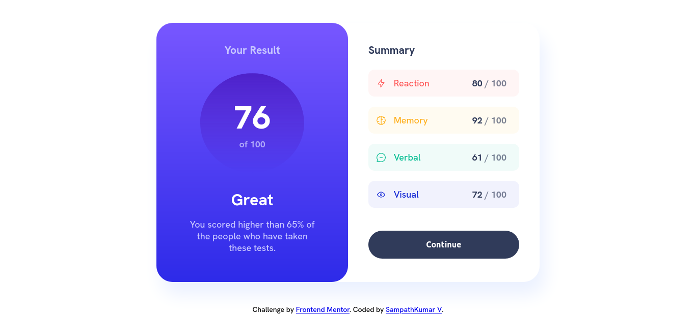
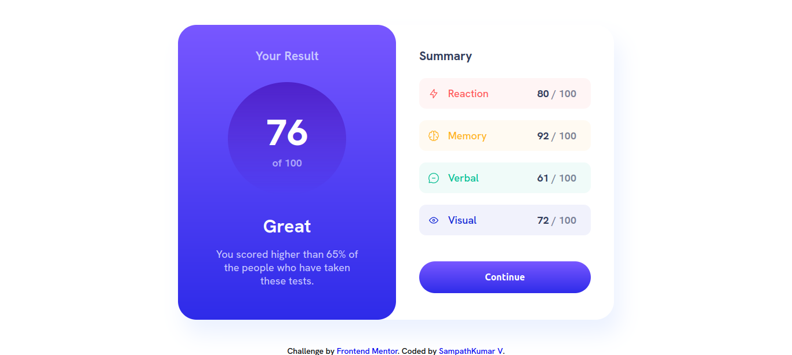
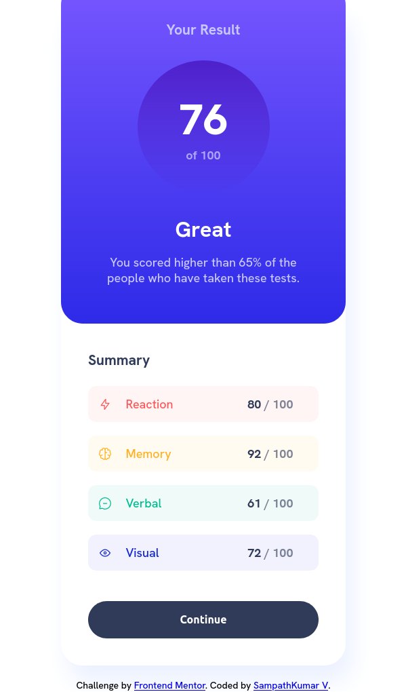

# Frontend Mentor - Results summary component solution

This is a solution to the [Results summary component challenge on Frontend Mentor](https://www.frontendmentor.io/challenges/results-summary-component-CE_K6s0maV). Solution can be found [here](https://github.com/sampath-ops/FrontEndMentor_Challenges.git)

## Table of contents

- [Overview](#overview)
  - [The challenge](#the-challenge)
  - [Screenshot](#screenshot)
  - [Links](#links)
- [My process](#my-process)
  - [Built with](#built-with)
  - [What I learned](#what-i-learned)
    - [Example](#example)
  - [Continued development](#continued-development)
  - [Useful resources](#useful-resources)
- [Author](#author)

## Overview

### The challenge

Users should be able to:

- View the optimal layout for the interface depending on their device's screen size
- See hover and focus states for all interactive elements on the page

### Screenshot





### Links

- Solution URL: [Add solution URL here](https://your-solution-url.com)
- Live Site URL: [Add live site URL here](https://your-live-site-url.com)

## My process

### Built with

- Semantic HTML5 markup
- CSS custom properties
- Flexbox
- Grid
- SCSS (Sassy css)
- rem(root em)

### What I learned

 - Throughout this project, got a refresh on how to use Sassy css and it features.
 - Learned to change color using hsla() based on the design. Linear gradient color makes front end more attractive should be used effectively. 
 - Got an idea of having a clean and neat html structures and how to name the class for css. 
 - sassy css makes css selector more efficient and easy. variables were easy to use. mixins provide easy implementation of media queries with different breakpoints. 
 - sassy css automatically generating the style.css with `webkit and ms` prefixes.
    - The -webkit- prefix is used for properties that are specific to WebKit-based browsers, such as Google Chrome, Safari, and Opera. 
    - The -ms- prefix is used for properties that are specific to Microsoft Internet Explorer and Microsoft Edge.
    - These prefixes are used to ensure that the CSS property is interpreted correctly by different web browsers.
 - Used `rem` instead of px, rem (root em) is a relative unit of measurement that is based on the root font size of the document, while px (pixels) is an absolute unit of measurement that is based on the physical screen pixels. rem provides a more flexiblity and scalablity to design.

#### Example
Lets see an example of how the mixins were used,
In mixins.scss
```css
$breakpoints-down:("medium":"39.9375rem"); //639px
@mixin breakpoint-down($size){
    @media(max-width: map-get($breakpoints-down,$size)){
        @content
    }
};
```
we can use this mixin in other scss files by using following code
```css
.summary{
    padding:  2.5rem 2.5rem 2.5rem 3.75rem; // 25px 40px 25px 60px 
    border-radius: 0 2rem 2rem 0; // 0px 32px 32px 0px
    margin-left: -1.25rem; // -20px
    z-index: 0;
    @include breakpoint-down(medium){
        border-radius: 0 0 2rem 2rem; // 0px 0px 32px 32px
        padding: 3.75rem 2.5rem 2.5rem  2.5rem; // 60px 25px 40px 25px 
        margin-top: -1.25rem; // -20px
        margin-left: 0;
    }
}
```
In the above code snippet `summary` class styles were changed in the breakpoint of 639px. the styles inside breakpoint-down() will be used if our device width is <= 639px.

### Continued development

User Interface should be scalable to More breakpoints to resize the components smoothly based on the device width, will try to implement the javascript to add some functionality to the interface. then advanced frameworks will be used to implement the design like `react` or `next`js.

### Useful resources

- [Sass](https://sass-lang.com/) - This helped me to have neat css styles. it helps me to work with styles based on different components.
- [@TheCoderCoder](https://www.youtube.com/@TheCoderCoder) - This youtube channel helps me to have a basic idea of scss and its features.

## Author
- Frontend Mentor - [@sampath-ops](https://www.frontendmentor.io/profile/sampath-ops).
